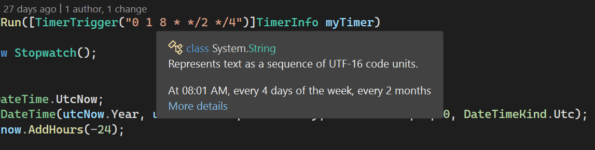
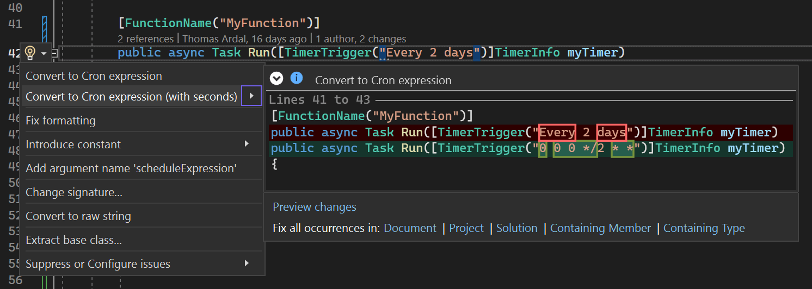
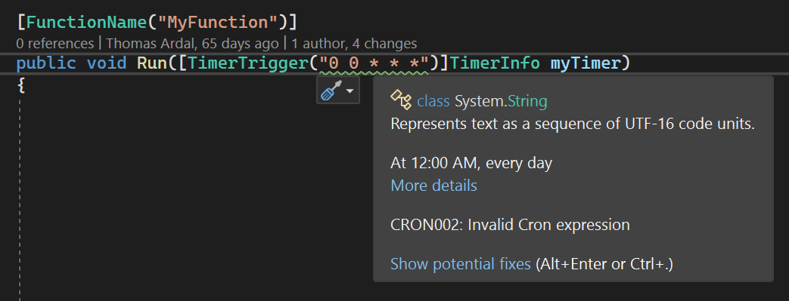
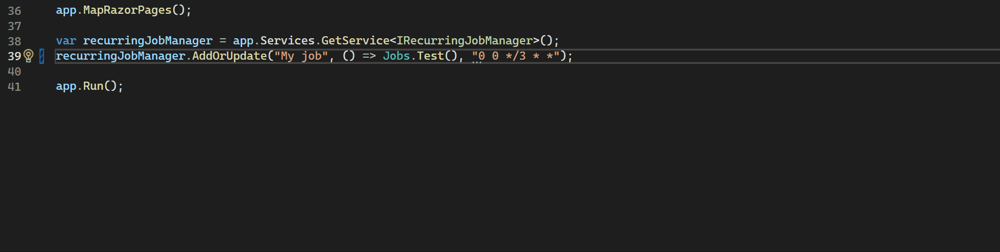

Cron Expressions
================

This extension offer various helpers when working with Cron expressions in Visual Studio.

Quick info when hovering Cron expressions in Visual Studio:

Convert human-readable text to a Cron expression:

Find invalid Cron syntax with frameworks like Azure Functions, Quartz.NET, NCrontab, and Hangfire:

Generate a comment with explanation of a Cron expression:

---

Sponsored by [elmah.io](https://elmah.io).
